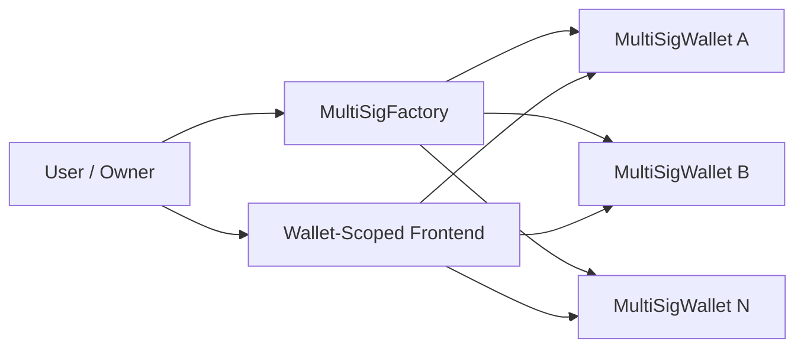
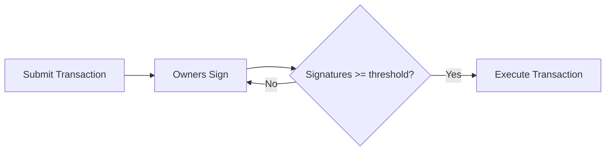
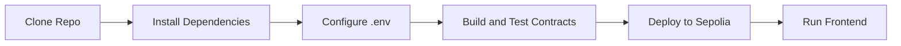
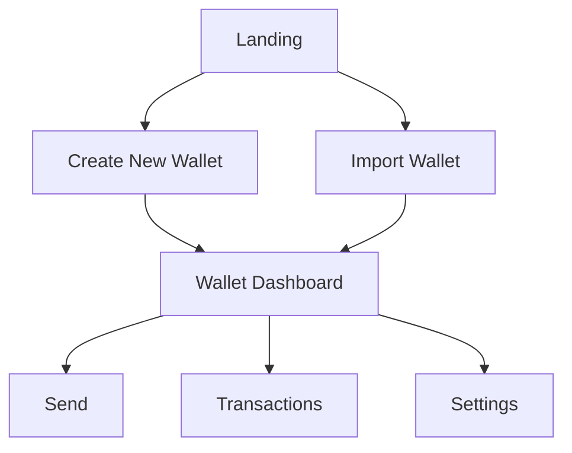

```text
+===============================================================+
|   ____        _ _               _         __  __ _       ____ |
|  / ___|  ___ | | |__   ___  ___| |_ _   _|  \/  (_) __ _/ ___||
|  \___ \ / _ \| | '_ \ / _ \/ __| __| | | | |\/| | |/ _` \___ \|
|   ___) | (_) | | | | | (_) \__ \ |_| |_| | |  | | | (_| |___) |
|  |____/ \___/|_|_| |_|\___/|___/\__|\__, |_|  |_|_|\__, |____/ |
|                                      |___/         |___/       |
+===============================================================+
```

Factory-first multi-sig monorepo with wallet-level isolation and wallet-scoped Next.js UX for Sepolia


> Theme note: diagrams and badges are designed to stay readable in both GitHub light and dark themes

## Table of Contents

- 🧭 [Overview](#overview)
- ✅ [Prerequisites](#prerequisites)
- 🧱 [Tech Stack Cards](#tech-stack-cards)
- 🏗️ [Architecture](#architecture)
  - 🧪 [Transaction Lifecycle](#transaction-lifecycle)
  - 🛣️ [Wallet-Scoped Routing](#wallet-scoped-routing)
- 🌳 [Project Structure](#project-structure)
- 🚀 [Quick Start](#quick-start)
- 🧰 [Workspace Commands](#workspace-commands)
- 🔐 [Environment Variables](#environment-variables)
- 📦 [Contracts](#contracts)
- 🖥️ [Frontend Flow](#frontend-flow)
- 🧪 [Testing](#testing)
- 🚢 [Deployment Guide](#deployment-guide)
- 🛠️ [Troubleshooting](#troubleshooting)
- 🤝 [Contributing](#contributing)
- 📄 [License](#license)

## Overview

This monorepo uses a factory-first model where each created wallet is an isolated `MultiSigWallet` instance.

- Governance is proposal-driven: owner and threshold updates are protected by `onlySelf`
- Transactions follow a clean lifecycle: submit -> sign -> execute
- Frontend routes are wallet-scoped for safe context isolation

## Prerequisites

- [x] Node.js `>=22` 
- [x] pnpm `10.6.2` 
- [x] Foundry (forge + cast) 
- [x] Sepolia RPC URL and deployer private key 

## Tech Stack Cards

| Stack | Role in Project | Card |
|---|---|---|
| Foundry | Build, test, deploy smart contracts | `forge build` `forge test` `forge script` |
| Next.js (App Router) | Wallet-scoped frontend UX | `/wallets/[walletAddress]/...` |
| TypeScript 5.7 | Type-safe app and hooks | `npx tsc --noEmit` |
| Wagmi + Viem | Wallet connections and chain reads/writes | Contract actions + onchain state |
| TailwindCSS | UI styling primitives | Utility-first layout and components |
| Solidity 0.8.24 | Multi-sig and factory contracts | `MultiSigWallet` + `MultiSigFactory` |

## Architecture



<details>
<summary><strong>Factory Pattern Notes</strong></summary>

- `MultiSigFactory` deploys independent wallet contracts
- Wallets are indexed by creator and owner for app discovery
- `WalletCreated` is emitted for indexers and UI sync

</details>

### Transaction Lifecycle



<details>
<summary><strong>Lifecycle Guarantees</strong></summary>

- Each tx tracks execution status and signature count
- Duplicate signatures are rejected
- Executed transactions cannot be replayed
- Failing external calls bubble up as execution failure

</details>

### Wallet-Scoped Routing

```mermaid
flowchart TD
    ROOT[/wallets/] --> NEW[/wallets/new]
    ROOT --> IMPORT[/wallets/import]
    ROOT --> DASH[/wallets/[walletAddress]]
    DASH --> SEND[/wallets/[walletAddress]/send]
    DASH --> TX[/wallets/[walletAddress]/transactions]
    DASH --> SETTINGS[/wallets/[walletAddress]/settings]
```

## Project Structure

```text
multi-sig/
├─ contracts/
│  ├─ src/
│  │  ├─ MultiSigWallet.sol      # core wallet logic: submit/sign/execute
│  │  └─ MultiSigFactory.sol     # wallet deployment + indexing
│  ├─ script/
│  │  └─ Deploy.s.sol            # Sepolia deployment scripts
│  └─ test/
│     ├─ MultiSigWallet.t.sol    # wallet lifecycle and governance tests
│     └─ MultiSigFactory.t.sol   # multi-wallet isolation tests
├─ frontend/
│  ├─ app/
│  │  └─ wallets/                # wallet-scoped pages
│  ├─ components/                # UI forms, dashboards, tx components
│  └─ lib/                       # hooks, ABIs, encoding utils
├─ package.json                  # workspace scripts
└─ README.md
```

## Quick Start



## Workspace Commands

### 🧩 Setup

```bash
pnpm install
npx tsc --noEmit
```

### 🖥️ Frontend

```bash
pnpm dev
pnpm build
pnpm lint
pnpm typecheck
```

### ⛓️ Contracts

```bash
pnpm build:contracts
pnpm test:contracts
```

### 🚢 Deploy

```bash
pnpm deploy:sepolia
```

## Environment Variables

Create `.env` from `.env.example` and set:

| Variable | Required | Description | Example |
|---|---|---|---|
| `SEPOLIA_RPC_URL` | ✅ | RPC endpoint used for script broadcasting | `https://sepolia.infura.io/v3/<key>` |
| `PRIVATE_KEY` | ✅ | Deployer private key for Foundry scripts | `0xabc123...` |
| `ETHERSCAN_API_KEY` | ⚪ Optional | Needed for `--verify` contract verification | `ABCDEFG12345` |

## Contracts

<details>
<summary><strong>MultiSigWallet (`contracts/src/MultiSigWallet.sol`)</strong></summary>

- ✅ Submit transaction proposals with destination, ETH value, and calldata
- ✅ Collect owner signatures with duplicate-sign prevention
- ✅ Execute only after threshold is met
- ✅ Restrict owner/threshold governance updates to `onlySelf`

> Security callout: governance mutations must pass through standard multi-sig execution flow, preventing unilateral owner-side state changes

</details>

<details>
<summary><strong>MultiSigFactory (`contracts/src/MultiSigFactory.sol`)</strong></summary>

- ✅ Deploy independent wallet instances
- ✅ Index wallets by creator for wallet discovery
- ✅ Index wallets by owner for owner-centric views
- ✅ Emit `WalletCreated` for off-chain app synchronization

</details>

### Build and Test (contracts)

```bash
cd contracts
forge build
forge test
```

### Optional Direct Wallet Helper

```bash
cd contracts
forge script script/Deploy.s.sol:DeployDirectWalletScript --rpc-url $SEPOLIA_RPC_URL --broadcast
```

## Frontend Flow

Landing -> Create New Wallet or Import Wallet -> wallet-scoped dashboard



<details>
<summary><strong>Dashboard</strong></summary>

- Wallet summary and pending transaction status
- Signer matrix and threshold-aware action prompts

</details>

<details>
<summary><strong>Send</strong></summary>

- Propose ETH send transactions
- Propose ERC-20 sends by encoding token `transfer` calldata

</details>

<details>
<summary><strong>Transactions</strong></summary>

- Review pending and executed transactions
- Sign and execute based on threshold status

</details>

<details>
<summary><strong>Settings</strong></summary>

- Propose owner additions/removals via self-targeted transactions
- Propose threshold updates through the same multi-sig flow

</details>

## Testing


```bash
cd contracts
forge test                 # standard run
forge test -vv             # verbose traces
forge test -vvv            # max verbosity with deeper call logs
```

Gas-focused example:

```bash
cd contracts
forge test --gas-report
```

Current coverage focus:

- `contracts/test/MultiSigWallet.t.sol`: ETH transfer lifecycle and self-governance constraints
- `contracts/test/MultiSigFactory.t.sol`: independent wallet deployment and isolation behavior

## Deployment Guide

1. [ ] Install workspace dependencies

   ```bash
   pnpm install
   ```

2. [ ] Create `.env` from `.env.example` and set Sepolia/deployer values

3. [ ] Validate contracts compile and tests pass

   ```bash
   pnpm build:contracts
   pnpm test:contracts
   ```

4. [ ] Deploy factory script

   ```bash
   pnpm deploy:sepolia
   ```

5. [ ] Verify deployment result and copy emitted factory address into frontend config as needed

## Troubleshooting

<details>
<summary><strong>pnpm not found</strong></summary>

Install and activate pnpm:

```bash
corepack enable
corepack prepare pnpm@latest --activate
```

</details>

<details>
<summary><strong>forge command not found</strong></summary>

Install Foundry and reload shell:

```bash
curl -L https://foundry.paradigm.xyz | bash
~/.foundry/bin/foundryup
```

</details>

<details>
<summary><strong>deployment fails with RPC/auth errors</strong></summary>

- Confirm `SEPOLIA_RPC_URL` is set and reachable
- Confirm `PRIVATE_KEY` is funded on Sepolia
- If verification fails, check `ETHERSCAN_API_KEY`

</details>

<details>
<summary><strong>transaction execution reverts</strong></summary>

- Ensure enough signatures are collected before execute
- Confirm wallet has enough ETH or token balance
- Validate calldata encoding for contract interactions

</details>

## Contributing

Contributions are welcome. Keep changes focused, include tests for contract behavior updates, and run:

```bash
npx tsc --noEmit
pnpm test:contracts
```

## License

MIT
